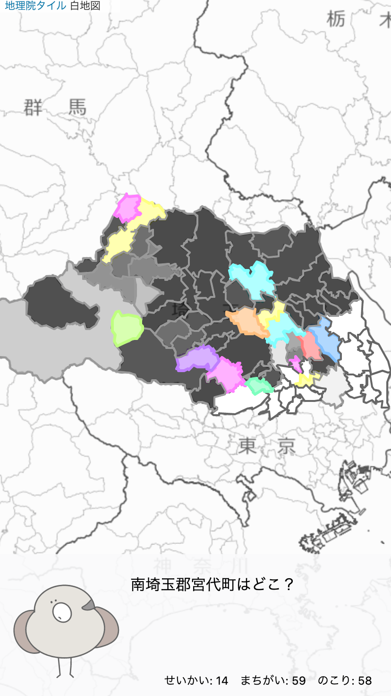

# kobirt (こばと ・ 小鳩)
とりさんといっしょに地図を色ぬりしながら埼玉県の市区町村に詳しくなれるブラウザゲームです。

正解すると埼玉県がカラフルに彩られます。

# Demo
絶賛開発中。問題に合わせて色塗りできますが、まだ保存機能がないので再読込すると消えます。

https://sirakobirt.web.app/

# Why
自分が住んでいる県の市区町村を近所以外全然知らないのでもったいない気がしました。

コロナ禍もあり、住んでいる都道府県に出かける機会が増えそうなので作ってみました。

# Character Design
とりさんは[onoonoono5](https://twitter.com/onoonoono5)さんに書いていただきました。

# Technologies
### フレームワークなど
Vite + Vue3 + TypeScript

https://github.com/vitejs/vite

開発環境クソ速いです

### CSSフレームワーク
Windi CSS

https://windicss.org/

開発中もクソ速いし、使ってるCSSだけ書き出せるのでクソ速いです。

### ホスティング

Firebase

PRでプレビューURL作成できるようになって便利。

### CI/CD
GitHub Actions

public無料は正義
### 地図ライブラリ
Leafletを使っています。TypeScriptネイティブじゃないけど@typesでなんとかなってる。

https://leafletjs.com/

### 境界データ
行政区域データのgeojsonを使ってます。

https://nlftp.mlit.go.jp/ksj/jpgis/datalist/KsjTmplt-N03.html
### 地図タイル
地理院タイルを使ってます。

地理院タイルを用いたサイト構築サンプル集

https://maps.gsi.go.jp/development/sample.html
# Roadmap
- 市区町村のよみがなつける
- 市区町村ごとにヒントとか、豆知識の文章つける
- ブラウザに保存機能
- サーバー側に保存機能（Firebase）
- 共有機能

# Contributing
準備中

# Author

[uyamazak](https://github.com/uyamazak)

# License
Apache (イラストを除く)
